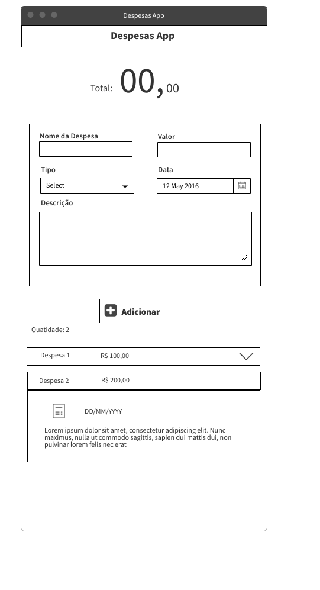
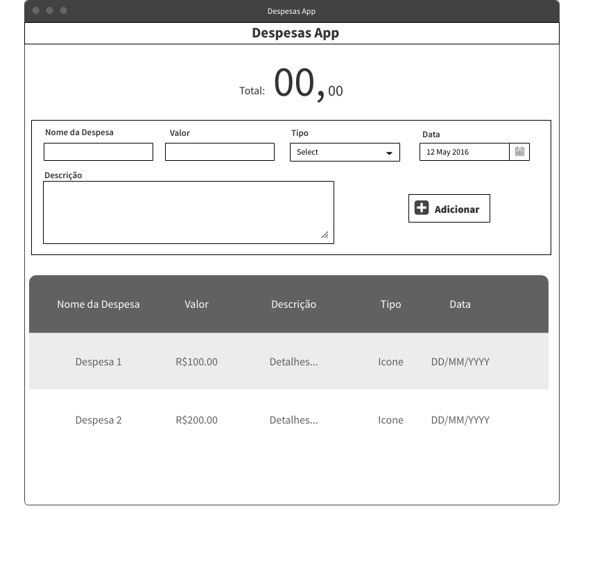

# Despesas App

Sempre gostei de calcular minhas despesas para que não houvesse surpresas no fim do mês e controlar meus gastos.

E após concluir o projeto TrybeWallet, me surgiu a ideia de mudar um pouco o funcionamento do projeto, reiniciar do zero tudo, e simular um planejamento de projeto como fiz em um projeto chamado de Company App que está em andamento.

Eu vou levantar os requisitos funcionais, fazer brainstorm de ideias, criar um quadro Kanban e fazer "sprints".

## Tecnologias que pretendo usar:

1. React;
    -  Context API;
    -  Hooks;
1. React Icons;
1. React Router;
1. Styled Components;
1. _Outros conforme a necessidade_ ;

## Objetos e Atores da aplicação:

### 1. Usuário

- Nome - `string`;

### 2. Despesa

- ID - gerado automaticamente - `string`;
- Nome da Despesa - `string`;
- Tipo da Despesas - `[Conta, Trabalho, Comida, ..., Lazer]`; 
- Descrição - `string`;
- Valor - `number`;
- Data de criaçào ou data da despesa* - `date`;

## Levantamento de Requisitos Funcionais:

1. Fazer Login - somente nome;
1. Adicionar Despesas;
1. Mostrar "extrato" de despesas;
1. Excluir Despesas;
1. Editar Despesas;
1. Calcular total de Despesas;
1. Mostrar o valor total de forma destacada;
1. Filtrar Despesas;
1. Salvar no LocalStorage - ainda não aprendi arquitetar um DB;
1. _Outros conforme surge ideias_ ;

## Metodologia e estudos

- Uso do Kanban usando a plataforma Trello para organização;
- Para cada Requesito Funcional será feito brainstorm de ideias;
- Filtrar as melhores ideias e criar tasks referentes no Quadro;
- Estudar e usar o paradigma de programação funcional;
- Aprender Jest com uso do Context API;

[Quadro da aplicação](https://trello.com/b/idB5IFTr)

### RF01 - Fazer Login

- O que é preciso pra atingir o objetivo do requisito:
    - Criar uma página de Login;
    - Usar a rota "/" da aplição;
    - Usar somente nome para fazer Login;
    - Criar uma chave `name` no context da aplicação;
    - Criar um botão para entrar;

### RF02 - Adicionar Despesas

- O que é preciso pra atingir o objetivo do requisito:
    - Criar uma chave `expenses` no context da aplicação, será uma lista de objetos;
    - Criar um formulário para preencher as informaçòes.
    - Criar um botão para adicionar a despesa na aplicação (adicionar como valor da chave `expenses`);

## Estilização da aplicação

- Aplicação responsiva - Mobile First;
- Criar conjunto de componentes para cada tela diferente;
- Usar Styled Components;
- Paleta de cores
    - Cor primária: #6D3278;
    - Cor Secundária: #F9F3FC;
    - Cor de Fundo: #F9F3FC;
    - _Outras cores conforme o andamento_ ;
- Pedir ajuda para colegas com criatividades e efeitos;

## Wireframes

Wireframe para telas pequenas

    

    

Wireframe para telas desktop

    

    

